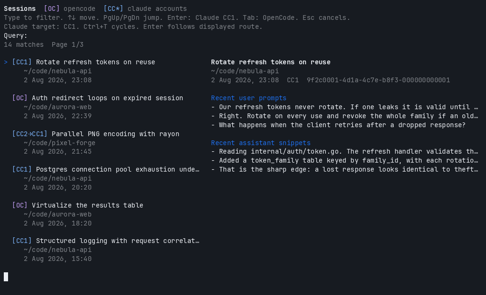

<h1 align="center">ocs</h1>

<p align="center">
  <b>One picker for every OpenCode, Claude Code and Codex session on your machine.</b><br>
  Search every project and account, jump back in, or carry the conversation into another tool.
</p>

<p align="center">
  <a href="https://github.com/sergio-gimenez/opencode-sessions/actions/workflows/ci.yml"></a>
  <a href="LICENSE"></a>
  =20" src="https://img.shields.io/badge/node-%3E%3D20-brightgreen.svg">
  
</p>

<p align="center">
  
</p>

<p align="center"><sub>The demo runs against synthetic sessions; see <a href="demo/README.md">demo/</a>.</sub></p>

## Why

Your work is spread across three tools and however many accounts you signed into.
Finding the session where you actually solved something means remembering which
tool you were in, `cd`-ing to the right repo, then paging through a separate
resume list for every tool and every account.

`ocs` reads those stores directly and puts everything in one list, newest first,
searchable by the words you typed rather than only the title a tool gave it.

## Install

Needs Node 20+ and at least one of OpenCode, Claude Code and Codex.

```bash
git clone https://github.com/sergio-gimenez/opencode-sessions.git
cd opencode-sessions
npm install
npm run build
npm run install:local     # puts `ocs` in ~/.local/bin, no root needed
```

Then:

```bash
ocs
```

## Try it without touching your own sessions

```bash
npm run demo
```

That builds a synthetic history (two Claude accounts, two Codex accounts, an
OpenCode store, four invented projects) and runs the real picker against it with
opening stubbed out. Nothing of yours is read and nothing gets launched. Details
in [`demo/README.md`](demo/README.md).

## Keys

| Key | What it does |
| --- | --- |
| type | Filter by title, directory and your prompts |
| `↑` `↓` | Move the selection |
| `PgUp` `PgDn` `Home` `End` | Jump |
| `Enter` | Follow the displayed route |
| `Ctrl+F` | Fork: follow the same route, but branch into a new session |
| `Ctrl+T` | Cycle the target forwards: OpenCode → each Claude account → each Codex account |
| `Shift+Tab` | Cycle the target backwards |
| `Tab` | Open in the *next tool* right away, as a transcript-seeded fork |
| `Esc` `Ctrl+C` | Cancel |

## Reading the list

Every row carries a badge saying where the session lives and where `Enter` will
take it.

| Badge | Meaning |
| --- | --- |
| `[OC]` | An OpenCode session, resumed natively. |
| `[CC1]` | A Claude session owned by account `cc1`, resumed natively. |
| `[CX1]` | A Codex session owned by account `cx1`, resumed natively. |
| `[CC1→CC2]` | Owned by `cc1` while `cc2` is the target, so `Enter` forks it into `cc2`. |
| `[CX1→OC]` | A Codex session while OpenCode is the target, so `Enter` forks it into OpenCode. |

Until you press `Ctrl+T` the target follows the selection, so every row shows a
plain badge and `Enter` resumes whatever you picked in the account it already
belongs to. Cycling pins a destination; from then on each row shows the route to
it.

## Forking a session

`Enter` continues the picked session, so new turns land in the original
conversation. `Ctrl+F` follows the same route but branches: you get a new session
to take in a different direction, and the original stays exactly as you left it.

Inside one tool and account the fork is native, so the copy carries real session
state rather than a retelling of it:

```
claude --resume <id> --fork-session
opencode --session <id> --fork
codex fork <id>
```

Ids don't survive a hop between tools or between accounts, so across one of those
both `Ctrl+F` and `Enter` fall back to the transcript-seeded path below. That
path is already a fork; the original never changes either way.

The right column previews the selected session: title, directory, id, your most
recent prompts, plus recent assistant replies when you pass `--assistant`. Search
terms light up in both columns.

## Migration is a fork, not a move

Cross-tool and cross-account opens do **not** migrate a session. Ids are not
portable between OpenCode, Claude Code and Codex, or between two accounts of the
same tool, so `ocs` starts a **new** session in the target and pastes the old
transcript in as context. Consequences worth knowing:

- The original session still sits in its own tool, untouched.
- Ping-ponging (CC → CX → OC …) leaves a **chain of partial copies**, since every
  hop rebuilds state from a transcript instead of resuming the real thing.
- Fork from the **most recent** node, at the top of the list, or you carry a
  stale branch forward.

Do it deliberately, at a boundary that makes sense: a task is finished, you want
to keep the general context, and you'd rather continue in the other tool. `Tab`
is not a live round trip, so treat it as "start fresh over there, with this
history".

## Multiple accounts

Claude Code and Codex each keep credentials, config and session history under a
single home directory, which makes a second account nothing more than a second
home. Use each tool's normal home for the first account and an isolated one for
every account after that:

```bash
cc1() { command claude "$@"; }
cc2() { CLAUDE_CONFIG_DIR="$HOME/.claude-cc2" command claude "$@"; }

cx1() { command codex "$@"; }
cx2() { CODEX_HOME="$HOME/.codex-cx2" command codex "$@"; }
```

Authenticate each once (`cc2 auth login`, `cx2 login`), then tell `ocs` about
them in `~/.config/ocs/config.json`:

```json
{
  "skipPermissions": false,
  "claudeAccounts": [
    { "name": "cc1" },
    { "name": "cc2", "configDir": "~/.claude-cc2" }
  ],
  "defaultClaudeAccount": "cc1",
  "codexAccounts": [
    { "name": "cx1" },
    { "name": "cx2", "codexHome": "~/.codex-cx2" }
  ],
  "defaultCodexAccount": "cx1"
}
```

Omit `configDir` or `codexHome` for the tool's normal default account. `ocs` scans
each account's own store and remembers which account owns what, so a `cc1`
session resumes in `cc1` unless you deliberately retarget it.

Leave either block out and `ocs` falls back to that tool's default home, labelling
it `[CC]` or `[CX]`.

Pick the starting target from the command line when that helps:

```bash
ocs --target cx2            # any account name, or "oc" for OpenCode
ocs --claude-account cc2    # the same thing, said the long way
ocs --codex-account cx2
```

Full setup, verification and troubleshooting lives in
[Using multiple Claude Code accounts](docs/multiple-claude-accounts.md) and
[Using multiple Codex accounts](docs/multiple-codex-accounts.md).

## Permissions

Launch the target tool with permission checks bypassed
(`claude --dangerously-skip-permissions` / `opencode --auto` /
`codex --dangerously-bypass-approvals-and-sandbox`):

```bash
ocs --dangerous     # also --skip-permissions / --yolo
ocs --safe          # force checks back on, overriding the config default
```

Set the default in `~/.config/ocs/config.json` with `"skipPermissions": true`.
The CLI flag wins per run.

> **Note**
> Skipping permission checks lets the agent act on your filesystem without
> prompting. Turn it on only for directories where you accept that.

## Command line

| Flag | Effect |
| --- | --- |
| `--print` | List the 25 most recent sessions and exit, no picker |
| `--query <text>` | Start the picker with a filter already applied |
| `--assistant` | Search assistant replies too, not just your prompts |
| `--target <name>` | Start with this target: `oc`, or any configured account name |
| `--claude-account <name>` | Same, named for Claude accounts |
| `--codex-account <name>` | Same, named for Codex accounts |
| `--dangerous`, `--skip-permissions`, `--yolo` | Bypass permission checks |
| `--safe`, `--no-skip-permissions` | Force permission checks on |
| `--help`, `-h` | Usage |

### Dry run

Set `OCS_DRY_RUN=1` and `ocs` prints what it *would* launch (the command, the
account, the working directory) instead of launching it. Handy for checking how
a route resolves, and for bug reports:

```console
$ OCS_DRY_RUN=1 ocs
would run CODEX_HOME=~/.codex-cx1 codex <transcript seed, 1655 chars>
  in ~/code/nebula-api
```

## Where the data comes from

`ocs` reads each tool's existing store and never writes to them.

| Source | Path | Override |
| --- | --- | --- |
| OpenCode | `~/.local/share/opencode/opencode.db` (SQLite) | `OPENCODE_DB_PATH` |
| Claude Code | `~/.claude/projects/**/*.jsonl`, plus each account's `configDir` | `CLAUDE_PROJECTS_PATH` |
| Codex | `~/.codex/sessions/**/rollout-*.jsonl`, plus each account's `codexHome` | `CODEX_HOME`, `CODEX_SESSIONS_PATH` |
| `ocs` config | `~/.config/ocs/config.json` | `OCS_CONFIG_PATH` |

`ocs` skips a store that's missing or unreadable instead of dying on it, so not
having OpenCode installed still gets you your Claude and Codex sessions.

Codex files each session as a rollout under `sessions/YYYY/MM/DD/` and archives
one by moving it into `archived_sessions/`, so archived Codex sessions drop out
of the list the way archived OpenCode ones do. Codex stores no title in the
rollout, which is why a Codex row is titled by its opening prompt.

## Development

```bash
npm run dev          # run the picker from source
npm run print        # list recent sessions, no TUI
npm run demo         # picker against synthetic sessions, opening stubbed out
npm run typecheck
npm test
npm run build
```

See [CONTRIBUTING.md](CONTRIBUTING.md).

## License

[MIT](LICENSE) © Sergio Gimenez
